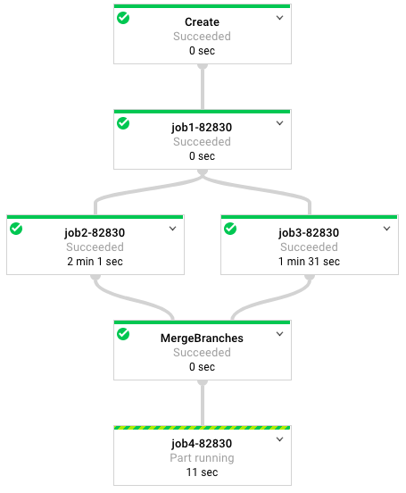

==========
Disclaimer
==========

This is not an official Google product.

==============================================
dview: a viewer for batch processing pipelines
==============================================

.. contents::

Overview
========

dview is an open-source viewer for batch processing pipelines submitted
using `dsub <https://github.com/googlegenomics/dsub>`_.

dview works by creating `Apache Beam <https://beam.apache.org/>`_
jobs, and relying on the Beam runner to provide the visualization. For example,
`Google Cloud Dataflow <https://cloud.google.com/dataflow/>`_
provides a live-updating view of the pipeline execution graph. When running dview
with Dataflow as the runner, you can open the Dataflow viewer to track progress.

dview supports any Apache Beam runner that offers graph visualization.  **However,
as of July 2017 Dataflow is the only runner that works with dview.** Beam python
runners for `Spark <https://beam.apache.org/documentation/runners/spark/>`_
and `Flink <https://beam.apache.org/documentation/runners/flink/>`_ are in development.

For testing, you can also run dview locally, without visualization.

Getting started
===============

1.  Install dview and add the executables to your `PATH`::

        git clone https://github.com/jbingham/dview
        cd dview
        make
        source ~/.bash_profile

2.  Verify the installation by running::

        dview --help

Getting started on Google Cloud
-------------------------------

To visualize workflow execution graphs with Google Dataflow, you'll need to sign up
for Google Cloud and create a cloud project and bucket to store your log files.

1.  Sign up for a Google Cloud Platform account and
    `create a project <https://console.cloud.google.com/project?>`_.

2.  `Enable billing <https://support.google.com/cloud/answer/6293499#enable-billing>`_.

3.  `Enable the APIs <https://console.cloud.google.com/flows/enableapi?apiid=genomics,storage_component,compute_component&redirect=https://console.cloud.google.com>`_.

4.  `Install the Google Cloud SDK <https://cloud.google.com/sdk/>`_ and run::

        gcloud init

    This will set up your default project and grant credentials to the Google
    Cloud SDK. Now provide `credentials <https://developers.google.com/identity/protocols/application-default-credentials>`_
    so dsub can call Google APIs::

        gcloud auth application-default login

5.  Create a `Google Cloud Storage <https://cloud.google.com/storage>`_ bucket.

    The dsub logs and output files will be written to a bucket. Create a
    bucket using the `storage browser <https://cloud.google.com/storage/browser?project=>`_
    or run the command-line utility `gsutil <https://cloud.google.com/storage/docs/gsutil>`_,
    included in the Cloud SDK.::

        gsutil mb gs://my-bucket

    Change ``my-bucket`` to a unique name that follows the
    `bucket-naming conventions <https://cloud.google.com/storage/docs/bucket-naming>`_.

    (By default, the bucket will be in the US, but you can change or
    refine the `location <https://cloud.google.com/storage/docs/bucket-locations>`_
    setting with the ``-l`` option.)

Running a workflow
==================

To view a multi-step batch job with dview, you first have to define your pipeline.
You launch dview at the top of your pipeline script, passing to dview the
names of the individual jobs in your pipeline. Then run the script.

The best way to understand is to look at an example in the `examples` directory.

Running a bash workflow
-----------------------

In the `examples` directory, open `dview_example.sh` and have a look. Make sense?

If you run the example as-is, it will execute locally as a dry run. To run on
Google Cloud, make a copy of ``dview_example.sh`` called ``my_example.sh``. Set the marked
parameters at the top of the script based on your Google Cloud Project details,
including the project and bucket you created above. Then run::

    ./my_example.sh

The script should emit a bunch of messages, then exit happily. To view the live
execution graph, open your browser to::

    https://console.developers.google.com/project/my-project/dataflow/job

Change ``my-project`` to the name of your Cloud project. You will see a list
of your Dataflow jobs, and you can click on your new Dataflow job name
to view the execution graph that will live-update as your job runs.

What next?
==========

*  See more `documentation for dsub <https://github.com/googlegenomics/dsub>`_
